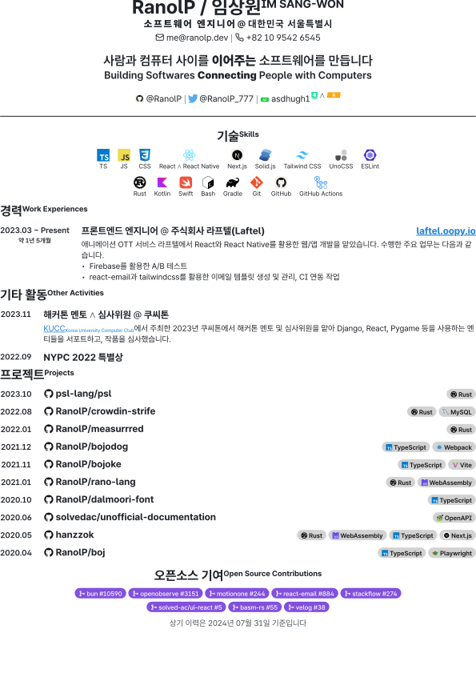

<picture>
  <source media="(prefers-color-scheme: dark)" srcset="./cover/page-dark-1.svg">
  <source media="(prefers-color-scheme: light)" srcset="./cover/page-light-1.svg">
  
</picture>

# résumé

Modern résumé built with Typst

## Dev Environment

- Use VS Code for editor (contains recommended extension and settings).
- Use mise or asdf-compatible version manager and activate here.
- Run `./scripts/src/prebuild.ts` when you need and compile it with `typst compile resume.typ`.

## Special Thanks

- [shiftpsh](https://github.com/shiftpsh) for his impressive cv design and the [solved.ac](https://solved.ac) service
- [Open Color](https://yeun.github.io/open-color/) for good palette
- [Icones](https://icones.js.org/) for easier icon search
- [Iconify](https://iconify.design/) for icon CDN
- [Typst](https://typst.app/) for awesome markup language
